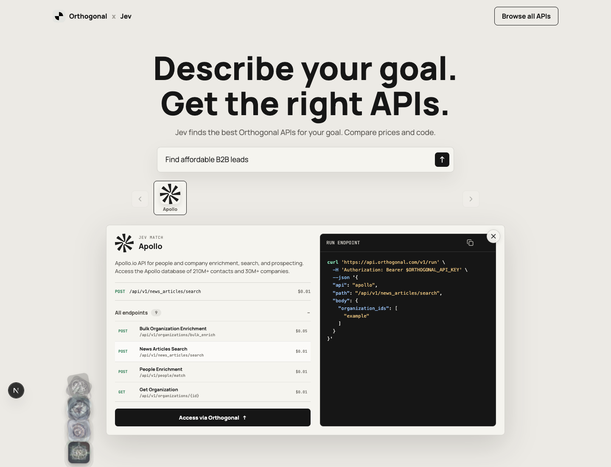
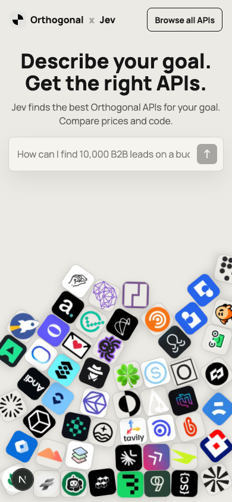

# Jev selector — fluid API discovery

- Live reference: https://findtherightapi.vercel.app
- Motion reference: https://x.com/heystefan_/status/2101369117496521042?s=20
- Project: `/Users/jerrydu/Github Repositories/jev-selector`
- Captured: 2026-09-22

## Why this is worth reusing

The page makes a technical catalog feel tangible without turning it into a decorative marketing site. Real provider marks behave like physical objects, then the same objects resolve into an orderly comparison state after a search. The warm light canvas, restrained chrome, compact typography, and single dark code surface keep the motion as the focal idea.

## Visual DNA

- Page `#ECEAE5`, surfaces `#F5F4EF`, ink `#161616`, fine black borders at roughly 14% opacity.
- Manrope for interface text and JetBrains Mono for endpoints and code.
- Eight-pixel interface radii; API marks are rounded-square objects, not logos placed on generic white tiles.
- Large direct headline, one sentence of support, one prompt, and a compact top navigation.
- Real, crisp provider marks only. Each provider appears once in the pile.

## Interaction pattern

1. Start with an overlapping Matter.js pile that feels irregular and weighted, not arranged into a visible grid or arrow.
2. Nearby objects move away from the pointer with a capped force. The response should be obvious but should never launch objects across the viewport.
3. On search, matching objects rise from the pile and settle into an upright horizontal carousel.
4. Selecting a carousel item opens one stable detail surface with an expandable endpoint list, prices, CTA, and syntax-highlighted code that updates with the chosen endpoint.
5. Closing results clears the entire result state and restores the pile. Resizing reconciles both DOM dimensions and physics bodies.

## Preserve

- One strong motion system: physical discovery becoming ordered comparison.
- Visible overlap and natural collisions; do not mask or crop the pile.
- Capped velocity, restrained bounce, and reduced-motion behavior.
- Upright, low-jitter results after the physics-to-interface transition.
- Responsive geometry driven by container size, including breakpoint changes.

## Avoid repeating

- Symmetric spawn positions that form arrows or grids.
- White badge tiles behind existing rounded-square brand marks.
- Duplicate providers, placeholders, generic icons, or low-resolution favicons.
- Drag forces that fling objects, continuous jitter after results settle, or rotated carousel logos.
- Fixed physics dimensions that become stale after resizing.
- Hiding only the detail card while leaving faded result state behind.

## Reuse boundary

Treat this as interaction and aesthetic inspiration, not a universal site preset. Re-extract current brand tokens and validate every logo for the next project. The implementation received an engineering review, but future projects should reuse the mechanics and constraints rather than copying the component wholesale.
